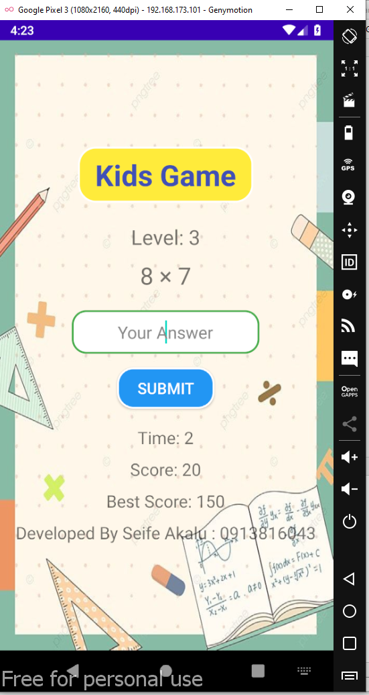

# Kids Math Game 🎮

A fun **math game for kids** made in Android Studio.  
Levels include addition, subtraction, multiplication, division, and mixed 3-number operations.  
Features include timers, shake animations, error sound, and persistent best score.

---

## 🎬 Screenshots

### Level 1 – Addition
![Level 1]


### Level 2 – Subtraction


### Level 3 – Multiplication


### Level 4 – Division


---

## ⚡ Features

- Addition, subtraction, multiplication, division
- Decimal/floating-point answers for all levels
- Shake animation & error sound for wrong answers
- Countdown timer for each question
- Best score stored in SQLite DB
- Styled buttons, EditText, and background image

---

## 🛠 How to Run

1. Clone the repository:

```bash
git clone https://github.com/username/AndroidKidsGameWithLittleHelpOfChatGPT.git
